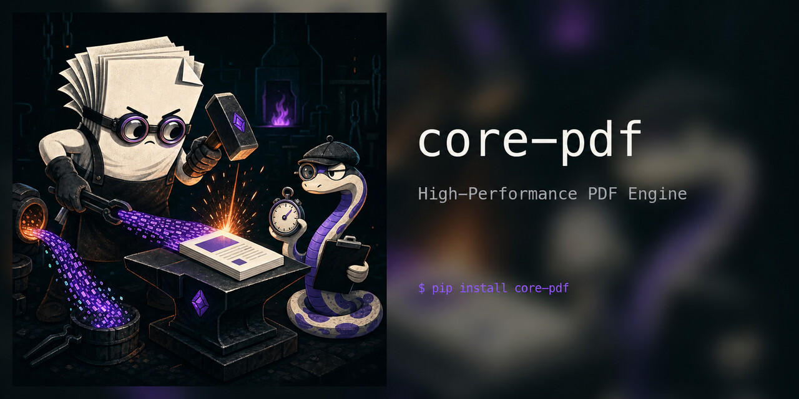

# core-pdf

**High-Performance PDF Engine**

## Text extraction

`core-pdf` currently extracts text from native PDF text objects only. Image-only and
scanned pages return no extracted text; OCR is intentionally provided separately and is
not invoked by this package.

## License

core-pdf uses [Core License version 0.1.0](https://github.com/core-experiments/core-pdf/blob/main/docs/license/VERSION.md).

Unless a separate signed evaluation license, commercial license, or philanthropy waiver applies, core-pdf is licensed under the GNU Affero General Public License version 3 only. See [LICENSE.txt](LICENSE.txt).

Evaluation licenses, commercial licenses, and philanthropy waivers are available separately. See the [license documentation](https://github.com/core-experiments/core-pdf/blob/main/docs/license/README.md), [notice](https://github.com/core-experiments/core-pdf/blob/main/docs/license/NOTICE), [evaluation terms](https://github.com/core-experiments/core-pdf/blob/main/docs/license/LICENSE-EVALUATION.txt), [commercial terms](https://github.com/core-experiments/core-pdf/blob/main/docs/license/LICENSE-COMMERCIAL.txt), and [philanthropy waiver terms](https://github.com/core-experiments/core-pdf/blob/main/docs/license/LICENSE-PHILANTHROPY-WAIVER.txt). Those alternatives are effective only when signed by the project licensor.

Contact: <turcioskevinr@gmail.com>
