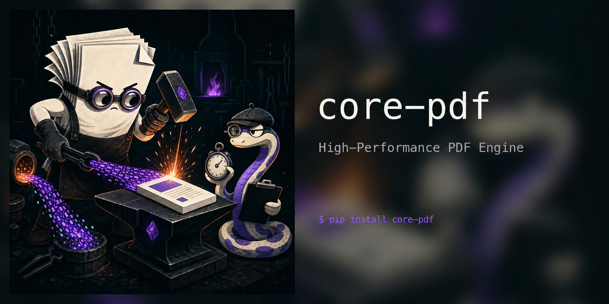

# core-pdf

High-Performance PDF Engine



`core-pdf` is a local PDF engine for Python 3.14+. It parses native PDF text, images,
graphics, and structure, extracts them into a structured document, and renders pages to
pixels. OCR, third-party API compatibility, and standards validation are separate
companion packages; installing one never changes the behavior of `core_pdf`.

## Install

The current release, 0.0.7, installs from a checkout of this repository with
[uv](https://docs.astral.sh/uv/):

```sh
uv sync                 # core-pdf and its dependencies
uv sync --all-packages  # plus the OCR, compatibility, and validation companions
```

The `core-pdf` on PyPI is 0.0.5, an earlier release from before the package split; the
other workspace packages are not published there yet.

Core depends on [`core-pdf-cythonized`](packages/core-pdf-cythonized/README.md), compiled
kernels with no pure-Python fallback, so a source install needs a C compiler. CI builds
CPython 3.14 wheels for Linux (x86_64, aarch64) and Windows (AMD64); macOS builds from
the sdist.

## Quick start

```python
from core_pdf import PdfDocument

with PdfDocument("document.pdf") as document:
    result = document.extract()  # or extract(pages=[1, 2])
    print(result.to_markdown())
```

`extract()` returns a structured `Document` with `text`, `pages`, `blocks`, `lines`,
`words`, and table views, and exporters for Markdown, JSON (schema 5.0), HTML, CSV, and
TEI. Pages expose their geometry and render directly:

```python
with PdfDocument("document.pdf") as document:
    page = document.pages[0]
    print(page.width_points, page.height_points)
    raster = page.render().rasterize(scale=2)  # 144 pixels per physical inch
    print(document.standards.effective_version)
```

See the [public API guide](docs/api.md) for page coordinates, capture options,
extraction adapters, and the JSON schema.

## Command line

```sh
core-pdf document.pdf --print            # Markdown to stdout
core-pdf reports/ -r -o out/             # every PDF under reports/, one .md each in out/
python -m core_pdf document.pdf --write  # write the Markdown file to disk
```

| Option | Effect |
| ------ | ------ |
| `-r`, `--recursive` | Scan directories recursively for PDF files |
| `-p`, `--print` | Print extracted Markdown to stdout |
| `-w`, `--write` | Write Markdown files to disk |
| `-o`, `--output-dir DIR` | Directory for output files (implies `--write`) |

Without `--print`, `--write`, or `--output-dir` the command parses its inputs and emits
no content.

## Packages

The repository is a uv workspace. Each package is versioned and installable on its own.

| Package | Import | Purpose |
| ------- | ------ | ------- |
| `core-pdf` | `core_pdf` | Document API, reader recovery, font backends, extraction, rendering, CLI |
| [`core-pdf-ocr`](packages/core-pdf-ocr/README.md) | `core_pdf_ocr` | OCR and vector text recognition for scanned and hybrid documents |
| [`core-pdf-compat`](packages/core-pdf-compat/README.md) | `core_pdf_compat` | Facades for pdfminer, pdfplumber, pypdf, pikepdf, unstructured, llamaindex, and x-ray |
| [`core-pdf-validate`](packages/core-pdf-validate/README.md) | `core_pdf_validate` | PDF/A, PDF/UA, and WTPDF validation of original bytes through a local veraPDF |
| [`core-pdf-spec`](packages/core-pdf-spec/README.md) | `core_pdf_spec` | Strict PDF algorithms and semantic interfaces, one module group per ISO 32000 chapter |
| [`core-pdf-cythonized`](packages/core-pdf-cythonized/README.md) | `core_pdf_cythonized` | Compiled kernels for core's hot paths |
| [`core-postscript`](packages/core-postscript/README.md) | `core_postscript` | PostScript calculator subset from the PLRM |
| [`core-jbig2`](packages/core-jbig2/README.md) | `core_jbig2` | ITU-T T.88 JBIG2 decoder |
| [`core-pdf-crypto`](packages/core-pdf-crypto/README.md) | `core_pdf_crypto` | PDF ciphers and ISO/TS 32004 PDF MAC |
| [`core-adobe-fonts`](packages/core-adobe-fonts/README.md) | `core_adobe_fonts` | CFF, Type 2, Type 1, CMaps, AGL, and Core 14 metrics |
| [`core-records`](packages/core-records/README.md) | `core_records` | Value-class mixins shared by every package's records |

The packages form tiers. `core-records` is the lowest floor package, importing no other
workspace package. The referenced-standard kernels (`core-postscript`, `core-jbig2`,
`core-pdf-crypto`, `core-adobe-fonts`) are floor packages too, usable without PDF; all
but `core-pdf-crypto` build their records on `core-records`. `core-pdf-spec` wraps them with strict PDF semantics: it reports
malformed input rather than repairing it. `core-pdf` composes spec and the compiled
kernels with reader recovery, font backends, extraction, and rendering. The companions
(`core-pdf-ocr`, `core-pdf-compat`, `core-pdf-validate`) sit above core, which never
imports or discovers them; `core-pdf-ocr` and `core-pdf-compat` pin the exact core
release.

### OCR

For scanned or hybrid documents, install `core-pdf-ocr` and change the import. The
document and page interfaces, structured output, and CLI options are the same.

```python
from core_pdf_ocr import PdfDocument

with PdfDocument("scanned.pdf") as document:
    print(document.extract().to_markdown())
```

It needs Tesseract's English language data, from your system package manager or a
`TESSDATA_PREFIX` directory containing `eng.traineddata`. The `core-pdf-ocr` command and
`python -m core_pdf_ocr` accept the same arguments as `core-pdf`.

### Compatibility facades

`core-pdf-compat` reproduces the useful high-level behavior of each reference library on
the core engine, without importing the reference library.

```python
from core_pdf_compat import inspect_xray
from core_pdf_compat.pdfminer import extract_text
from core_pdf_compat.pdfplumber import open as open_pdf

print(extract_text("document.pdf"))
with open_pdf("document.pdf") as pdf:
    print(pdf.pages[0].extract_words())
findings = inspect_xray("document.pdf")
```

Two facades have optional extras. In the workspace, pass `--extra unstructured` or
`--extra pdfplumber` to `uv sync --all-packages`; uv resolves the spaCy model from the
configured source. For the published package the equivalents are:

```sh
# Unstructured: spaCy plus the pinned English model, which is not on PyPI
pip install "core-pdf-compat[unstructured]" \
  "https://github.com/explosion/spacy-models/releases/download/en_core_web_sm-3.8.0/en_core_web_sm-3.8.0-py3-none-any.whl"

# pdfplumber: Pillow, needed only for PageImage.show()
pip install "core-pdf-compat[pdfplumber]"
```

Importing `core_pdf_compat.unstructured` raises `ImportError` if the model cannot load;
the facade never downloads models at runtime. Without the `pdfplumber` extra, `show()`
raises `ImportError` naming it, while rendering, drawing, `save()`, and `_repr_png_()`
work without Pillow.

### Standards and validation

`PdfDocument.standards` exposes document versions, extensions, and unverified profile
claims. `core-pdf-validate` checks the original PDF bytes against a requested or declared
profile with a locally installed veraPDF. See
[PDF versions and standards validation](docs/standards.md) for supported interfaces and
coverage.

## Development

```sh
git submodule update --init --recursive                   # reference fixture corpora
uv sync --all-packages --all-groups --extra unstructured  # development environment
uv run --locked --all-packages --extra unstructured --group test --group vendor-test pytest -n auto
```

The suite includes differential tests that compare each compatibility facade with its
reference library over that library's own fixture corpus; set
`CORE_PDF_COMPAT_DIFFERENTIAL_FULL=1` to run every facade against every fixture. Lint and
type checks:

```sh
uv run --all-packages --group lint ruff check .
uv run --all-packages --group lint ruff format --check .
uv run --all-packages --group lint mypy
uv run --all-packages --group lint lint-imports
prek run --all-files
```

[AGENTS.md](AGENTS.md) covers dependency management, per-package isolation runs, and
commit conventions.

## Documentation

- [Public API and compatibility facades](docs/api.md)
- [PDF versions and standards validation](docs/standards.md)
- [Coverage and unused-code review](docs/coverage.md)
- [Benchmarks](tests/benchmarks/README.md)
- [Roadmap](docs/roadmap.md)

## License

core-pdf uses [Core License version 0.1.0](https://github.com/warpforgedotco/core-pdf/blob/main/docs/license/VERSION.md).

Unless a separate signed evaluation license, commercial license, or philanthropy waiver applies, core-pdf is licensed under the GNU Affero General Public License version 3 only. See [LICENSE.txt](LICENSE.txt).

Evaluation licenses, commercial licenses, and philanthropy waivers are available separately. See the [license documentation](https://github.com/warpforgedotco/core-pdf/blob/main/docs/license/README.md), [notice](https://github.com/warpforgedotco/core-pdf/blob/main/docs/license/NOTICE), [evaluation terms](https://github.com/warpforgedotco/core-pdf/blob/main/docs/license/LICENSE-EVALUATION.txt), [commercial terms](https://github.com/warpforgedotco/core-pdf/blob/main/docs/license/LICENSE-COMMERCIAL.txt), and [philanthropy waiver terms](https://github.com/warpforgedotco/core-pdf/blob/main/docs/license/LICENSE-PHILANTHROPY-WAIVER.txt). Those alternatives are effective only when signed by the project licensor.

Contact: <turcioskevinr@gmail.com>
